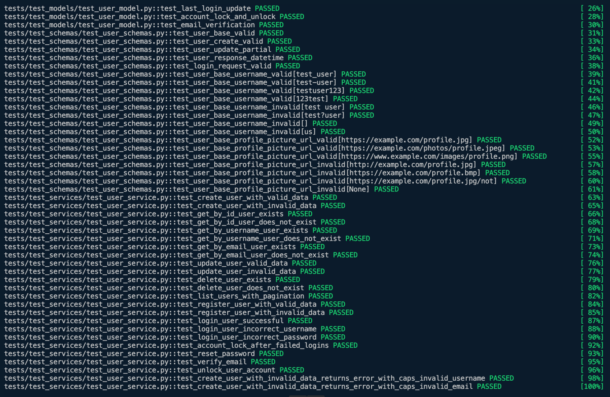

# Maniteja

## Event Manager Company: Software QA Analyst/Developer Onboarding Assignment
After setting up and following the guide, fastapi is up and running.

## Setup and Preliminary Steps
Make sure the github actions and docker hub tokens are updated accordingly and image build is triggered when needed.
Below is the change that address it: https://github.com/njitmani/homework10/commit/27ae5d47f49bc7308e54b7f3a0130c6451db7a6e

Able to create server and perform initial migration

## Testing and Database Management

Testing the application for test cases - all are up and running with no failures.

Database created and accessed via PGAdmin.

## Specific Issues to Address
## All the issues addressed and fixed as per the standards:

1. **Username validation**:
Issue Link: https://github.com/njitmani/homework10/issues/5
PR Link: https://github.com/njitmani/homework10/pull/6

2. **Password validation**:
Issue Link: https://github.com/njitmani/homework10/issues/11
PR Link: https://github.com/njitmani/homework10/pull/12

3. **Profile field edge cases**: 
Issue Link: https://github.com/njitmani/homework10/issues/7
PR Link: https://github.com/njitmani/homework10/pull/8

4. **Issue demonstrated in the instructor video**:
Issue Link: https://github.com/njitmani/homework10/issues/9
PR Link: https://github.com/njitmani/homework10/pull/10

5. **Add normalization to user name**:
Issue Link: https://github.com/njitmani/homework10/issues/1
PR Link: https://github.com/njitmani/homework10/pull/2

6. **Add normalization to email**:
Issue Link: https://github.com/njitmani/homework10/issues/3
PR Link: https://github.com/njitmani/homework10/pull/4

## Submission Requirements

Apart from all the links for issues and PR's mentioned above, find below the other links that are needed:

- Links to the closed issues: https://github.com/njitmani/homework10/issues?q=is%3Aissue+is%3Aclosed
- Link to project image deployed to Dockerhub: https://hub.docker.com/repository/docker/maniteja1998/assignment10/general

## Learning from working on this project

I enhanced my skills in software version control through hands-on management of a Git repository, using pull requests (PRs) to monitor changes and maintain code quality before merging them into the main branch. Additionally, I developed a deeper comprehension of RESTful API integration to facilitate smooth communication between services. This knowledge was applied to automate CI/CD pipelines, where successful builds initiate unit tests and lead to the deployment of containerized applications on DockerHub, simplifying the deployment and scaling of applications in real-world scenarios.
